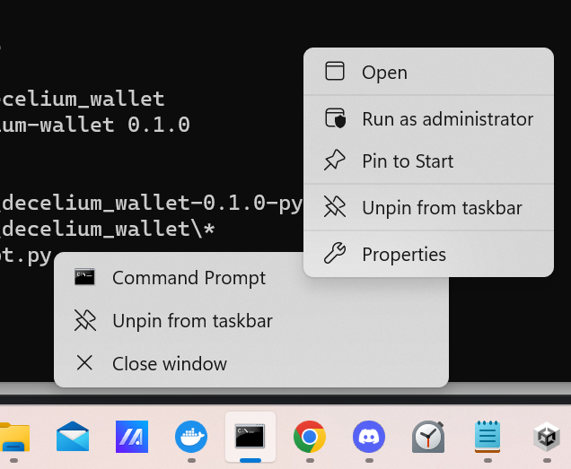

# Getting Started With the Command-line Interface

The Decelium wallet can be used from the command-line with Linux or from the Windows Command Prompt. This document will show you how to use the command-line interface to create a wallet, create a user ID in the wallet, and fund a user.

## Installation

### Linux

On Linux:

    pip install "git+https://github.com/Decelium/decelium_wallet.git"

### Windows

On Windows:



To use the command-line interface, you will need to install using Command Prompt as an administrator (see image).

    pip install "git+https://github.com/Decelium/decelium_wallet.git" 
  
## Using the Decelium Wallet from the Command-line Interface

Here is an example Python script that uses the Decelium wallet command-line tools to generate a wallet, generate a user in the wallet, create a user on Decelium, and fund the user's account.

A wallet contains user ID's and associated public/private key pairs.  A wallet and wallet user ID are needed for virtually every Decelium command, hence our first step is to create a wallet, which is created in an empty state.  The wallet requires a password; a password should be stored in a file called `.password` in, or up to three levels above, the working directory in which you are executing your commands.  If there is no `.password` file you will be prompted to enter a password at the keyboard. 
```bash
decw generate_a_wallet test_wallet1.dec
```
Now that we have a wallet, we can generate a user ID in the wallet. This will create a public/private key pair associated with the user ID, stored in the wallet.  We will name the wallet user ID "test_user". You will be prompted to confirm that you want to write the user to the wallet.
```bash
decw generate_user test_wallet1.dec test_user
```
In order to perform tasks such as uploading a website to Decelium, we have to also create a user on Decelium. This user is associated with a user ID, and hence public/private key pair, in the wallet.  We will create a user on Decelium with user name "test_user1" and password "passtest", which is associated with the "test_user" user ID in our wallet.
```bash
decw create_user test_wallet.dec test_user test_user1 test.paxfinancial.ai passtest
```
Many tasks on Decelium, including uploading a website, require a fee to be paid in Celium, the cryptocurrency Decelium runs on. We can fund our wallet with Celium with the `fund` command:
```bash
decw fund ./test_wallet.dec test_user test.paxfinancial.ai
```
Now that we have created a wallet, generated a user ID for it, created a user on Decelium, and funded our wallet with Celium, we are ready to perform other tasks on Decelium, such as uploading websites.

## Further examples

For further examples of the usage of `decw` please see [here](./CLI_USAGE_EXAMPLES.md). You can also consult the unit tests to see more examples.

 