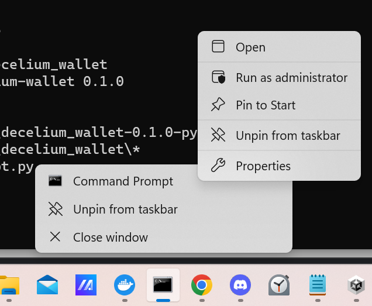

# Getting Started in Python

The Decelium wallet Python package allows you to use Decelium wallet modules in your Python programs.

## Prerequisites

You will need Python 3 and pip installed.

## Installation

On Linux:

    pip install "git+https://github.com/Decelium/decelium_wallet.git"

##### Windows

On Windows:



If you want to use the `decw` command-line tool, you will need to install using Command Prompt as an administrator (see image). Otherwise, you can still [use the Decelium wallet through Python](./PY_USAGE_EXAMPLES.md). 

    pip install "git+https://github.com/Decelium/decelium_wallet.git" 
    
    
## Using the Decelium Wallet in Python

To use the Decelium wallet commands in a Python program, you will need to import them:
```python
import decelium_wallet.commands.generate_a_wallet as generate_a_wallet
import decelium_wallet.commands.generate_user as generate_user
import decelium_wallet.commands.create_user as create_user
import decelium_wallet.commands.fund as fund
import decelium_wallet.commands.check_balance as check_balance
import decelium_wallet.commands.deploy as deploy
import decelium_wallet.commands.delete_user as delete_user  
```

Once you have imported the Decelium wallet, you can use it in your code. Here is an example script that uses the Decelium Wallet Node.js SDK to generate a wallet, generate a user in the wallet, create a user on Decelium, fund the user's account, deploy a website, and then delete the user from Decelium:

```python
import decelium_wallet.commands.generate_a_wallet as generate_a_wallet
import decelium_wallet.commands.generate_user as generate_user
import decelium_wallet.commands.create_user as create_user
import decelium_wallet.commands.fund as fund
import decelium_wallet.commands.check_balance as check_balance
import decelium_wallet.commands.deploy as deploy
import decelium_wallet.commands.delete_user as delete_user 
import uuid

gen_wallet=generate_a_wallet.run("./test_wallet.dec")
    
gen_user=generate_user.run("./test_wallet.dec","test_user","confirm")
    
test_username="test_user"+str(uuid.uuid4())
user_id=create_user.run("./test_wallet.dec","test_user",test_username,"test.paxfinancial.ai","passtest")

fund_result=fund.run("./test_wallet.dec","test_user","test.paxfinancial.ai")

balance=check_balance.run("./test_wallet.dec","test_user","test.paxfinancial.ai")    

website_id = deploy.run("./test_wallet.dec","test_user","test.paxfinancial.ai","test/example_small_website.ipfs","./website/")

del_result=delete_user.run("./test_wallet.dec","test_user",test_username,"test.paxfinancial.ai")
```

The uploaded website will be available at `https://test.paxfinancial.ai/obj/[website_id]/` where `[website_id]` is the value returned upon deploying the website, as in the script.

## Further Examples of Use of the Decelium Wallet in Python Programs

There are examples of the use of the Decelium wallet in Python programs [here](./PY_USAGE_EXAMPLES.md).